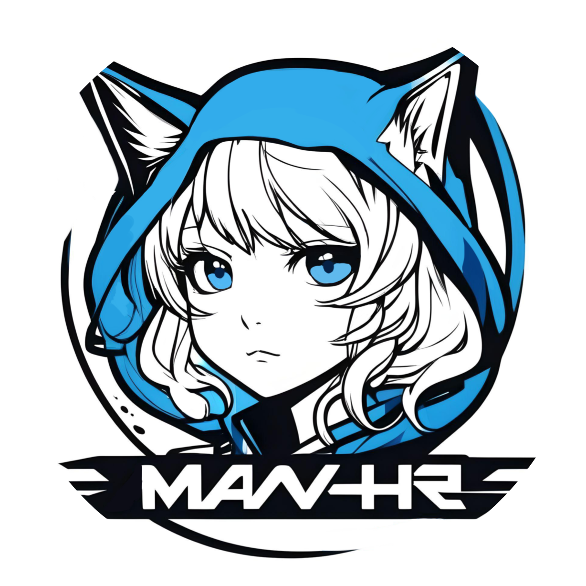

# MiawShare

Dikembangkan untuk memenuhi tugas mata kuliah pemrograman web.

        

## Aboutℹ️

MiawShare adalah platform komunitas online untuk berbagi karya, ide kreatif, dan gambar menarik. Dengan platform kami yang ramah pengguna, anda dapat dengan mudah menjelajahi berbagai ilustrasi oleh pengguna kami. Kami membangun MiawShare dengan tujuan untuk menciptakan komunitas yang inklusif dan mendukung, di mana setiap orang dapat merasa diterima dan dihargai. Kami menghargai keragaman dalam segala bentuknya dan berkomitmen untuk menciptakan lingkungan yang aman bagi semua orang untuk berekspresi dan berbagi.

## Languages & Database💻

## Feature💡

- Pendaftaran pengguna dan verifikasi OTP
- Notifikasi via [Bot Telegram](https://t.me/spamtestingbot)
- Upload dan hapus postingan
- Pencarian postingan lewat judul, deskripsi dan pengupload
- Edit informasi pengguna dan hapus akun
- Regenerate OTP, hapus postingan, tambahkan/edit/hapus pengguna (Admin)

## Credit📜

- MiawShare Official Logo: [by: RyanManganguwi](https://www.instagram.com/enokki43at)
- Gambar tambahan: [Forbiden Page](https://tenor.com/j5llAKTW5xF.gif) | [Not Found](https://tenor.com/usTAOkJQpDE.gif) | [Bye-bye](https://tenor.com/uzAzw3pnkQ7.gif) | [Default Profile](http://opening.download/view.php?pic=https://i.pinimg.com/474x/94/cb/68/94cb68baea50bb98cdab65b74e731c1c.jpg)
- Referensi: [Pinterest](https://www.pinterest.com/) | [Pixiv](https://www.pixiv.net/en/)
- Hosting: [IdCloudHost](https://my.idcloudhost.com/clientarea.php)
- Our team: [Yefta Asyel](https://github.com/yeftakun/) (Backend) | [Andro Lay](https://github.com/AndroLay/) (Frontend) | [Ryan Manganguwi](https://github.com/RyanManganguwi/) (Design & Frontend) | [Aulia Nurhaliza](https://github.com/AuliaNurhaliza/) (Frontend)

## Config⚙️

Copy file `template_environment.php` dan paste dengan nama `environment.php`. Sesuaikan isi file dengan token bot dan max size upload.